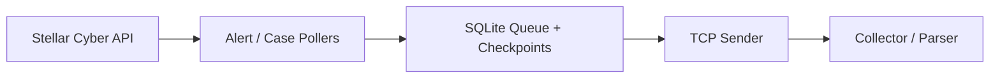

<div className="xdr-hero">
  <p className="xdr-kicker">Alert & Case integration</p>
  <h1 className="xdr-hero-title">Move Stellar Cyber alerts and cases into the workflows you already run.</h1>
  <p className="xdr-hero-copy">
    Stellar Relay polls the Stellar Cyber API, keeps durable queue and checkpoint state in SQLite, and forwards enabled Alert and Case streams as NDJSON over TCP.
  </p>
  <div className="xdr-hero-actions">
    <a className="xdr-hero-primary" href="/quickstart">Start the relay →</a>
    <a className="xdr-hero-secondary" href="/output-format">Review output format</a>
  </div>
  <div className="xdr-signal-grid">
    <div className="xdr-signal"><strong>Poll</strong><span>Read Alert and Case streams independently from the Stellar Cyber API.</span></div>
    <div className="xdr-signal"><strong>Queue</strong><span>Keep checkpoints and pending delivery state locally for recovery.</span></div>
    <div className="xdr-signal"><strong>Forward</strong><span>Deliver newline-delimited JSON over TCP into existing SIEM/SOC workflows.</span></div>
  </div>
</div>

> Some legacy option names contain "syslog", but the payload is newline-delimited JSON, not RFC 5424 syslog.

## How it works



Alert and Case streams are independent. Run Alert only, Case only, or both.

## Start here

<CardGroup cols={2}>
  <Card title="Quickstart" icon="rocket" href="/quickstart">
    Run the interactive wizard and optionally install the systemd service.
  </Card>
  <Card title="Configuration" icon="sliders" href="/configuration">
    Review CLI options, defaults, and validation rules.
  </Card>
  <Card title="Operations" icon="gear" href="/operations">
    Check service status, logs, restart, and reconfigure.
  </Card>
  <Card title="Output Format" icon="code" href="/output-format">
    Configure receivers for NDJSON over TCP.
  </Card>
  <Card title="Troubleshooting" icon="wrench" href="/troubleshooting">
    Diagnose service, API, receiver, queue, and checkpoint issues.
  </Card>
</CardGroup>

## Recommended first run

```bash
python3 Stellar_Alert_Case_Syslog.py
```

The wizard collects credentials and stream settings, then can install and start `stellar-alert-case-syslog.service` automatically.

Manual CLI operation remains available for automation and testing.
